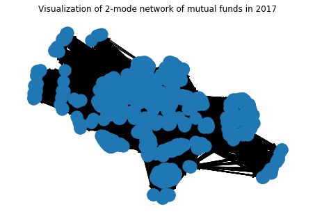
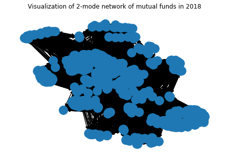
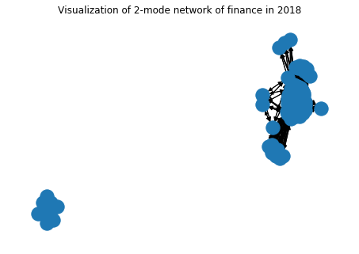
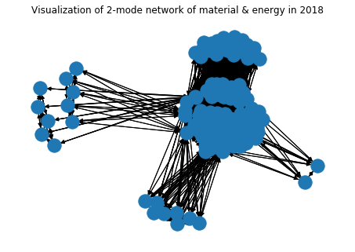
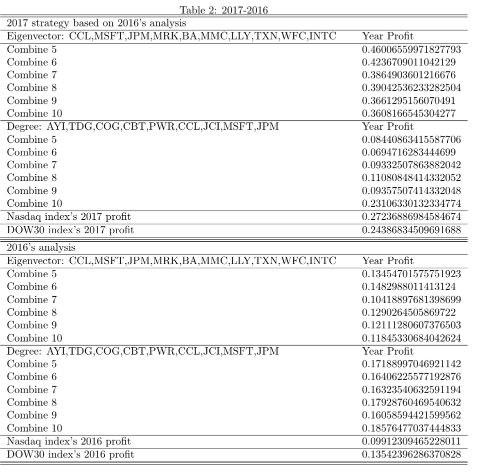

# stat578-final-project
  All of the csv files are raw data files. They come from annual report of 15 mutual funds which is recommended by Morningstar. They come from sec government database. The data size is over 20 thousands. The 2018-total.ipynb is the template source code to deal with raw data so that we can get the unique data of company's names in to a list and then we can generate the 1-mode network and 2-mode network. You can find the definition and the meaning of these two network from my term paper. 
  
  After preprossing data and generating network, we can use the package, networkx, to get the eigenvector centrality and degree centrality. They represent the influence and the popularity in the network. Therefore, we screen out the most accepted companies that expertise will buy for the following year. 
  
  
  This is the network for 2017 and you can see that some companies are centered and connected more to each other.
  
  
  This network for 2018 is similar to the one for 2017. However, as you can see that the centrality and quality have changed due to the change of experts' strategies. I have also created some network due to various sectors in Dow30: Health, Finance, and so on.
  
  
  
  This one is the network for finance. As you can see, nodes have been sectored and centered into two parts. In other words, Experts at 2018 are mainly focus on several stocks and if we follow their strategies, we can win some earns.
  
  
  
  This one is the network for material. As you can see, nodes are scattered. In other words, different expert will choose different stocks in this sector, which means, we will have more options to choose.
  
  By repeating this process from 2015 to 2018, I have found that the annual return will surpass the Nasdaq's index and Dow30's index at least 3 percentage. Sometimes, by choosing one of the centrality appropriately, we can get double return of Nasdaq's index. In other words, without transaction cost and assuming the volatility is 1, the sharp ratio is 1.
  
  
  
  This is the example of 2017 strategy based on 2016 analysis
  
   we can see that the result of selection and expected return of portfolio based on degree centrality and eigenvector centrality is different. Stocks in every list appear in decreasing order of measure. In other words, the first one in the list is most preferred among Mutual Fund’s managers. From the pattern of returns in every year, no matter which centrality we have chosen, we can see that the trend of increasing and decreasing of the portfolio in one year is similar for the pattern happened in the portfolio-foundation year. Therefore, we can say that, when we wonder which centrality we should choose for our portfolio, we should check what the behavior of the portfolio is in the last year and what the degree centrality and eigenvector centrality are separately. If degree centrality is much better than eigenvector centrality, we should choose the portfolio based on degree centrality and vice versa.

Further work:

Of course, this model has some problems: it is fitted in year-based investment and may not be fitted to quarterly or even shorter- time investment. The quarterly report we can get is much later than the managers invest and conclude. It has time-delay problem. During my process of gathering data from government website, I found that quarterly report for September will be release until November or later. Therefore, we may not be able to get the first-hand information and miss some good turns. Thus, even though is better for novice people, we still may have opportunity to improve the social network analysis to help them prevent more risks.
